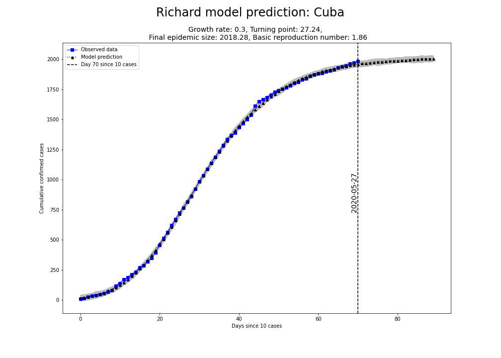
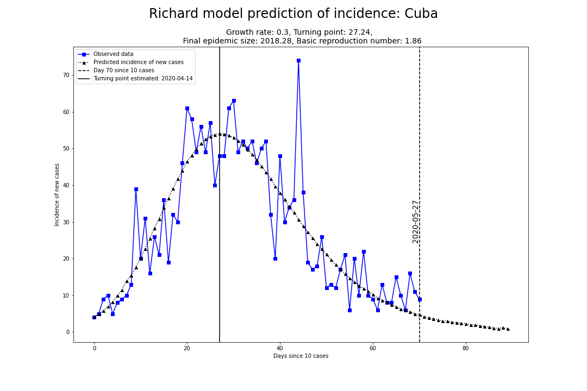
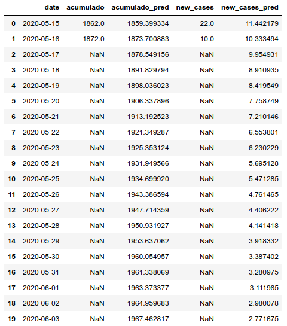

# Prediction of covid-19 with Richards model
*Last update: May 17, 2020*

## Introduction
The ongoing epidemic of a novel coronavirus illness (**COVID-19**) began in Hubei Province, China,
in December 2019 and continues to cause infections in multiple countries, that was 
confirmed as pandemic by World Health Organization since March 11, 2020. The **COVID-19** is 
affecting 210 countries and territories around the world. As of May 29, 2020, there have been
**5,910,176** cumulative cases, including **362,117** deaths, and **2,583,530** recovered, 
reported globally.  

To control the pandemic, several countries governments has enacted a range of social distancing 
strategies, such as cities-wides lockdowns, screening measures at train stations and airports, 
active case finding, and isolation of suspected cases. The numbers of cases and deaths continue 
to accumulate every day. However, the transmission appears to be slowing down in several contries 
due to strict lockdowns combined with isolation and quarantine measures.

Earlier work has shown that phenomenological growth models, including the Richards model, can capture 
the empirical patterns of past epidemics and are useful to generate short-term forecasts of the epidemic 
trajectory in real time. These approaches are especially useful when the epidemiological data are 
limited. Real-time short-term forecasts generated from such models can be useful to guide the 
allocation of resources that are critical to bring the epidemic under control [1].

## Richards model
The Richards model was first proposed by Ricahrds [2] in 1959 to model growth of biological 
populations. as a modification of logistic model [3], 

C'[t] = r * C[t] * (1 - (C[t]/K)^a)                                                     

where C[t] is the cumulative number of infected cases at time t in days, **K** is the carrying
capacity or total case number of the outbreak, **r** is the per capita growth rate of the 
infected population, and **a** is the exponent of deviation from the standard logistic curve.

Unlike models with several compartments commonly used to predict the spread of disease 
(e.g. SIR, SIS, SEIR, ...), 
the Richards model considers only the cumulative infective population size with saturation 
in growth as an outbreak progresses, which is possibly caused by factors such as depletion of 
susceptibles (e.g., wearing facemask to avoid contacts) or implementation of control measures 
like quarantine. 

The basic premise of the Richards model is that the daily incidence curve consists of a single 
peak of high incidence, resulting in an S-shaped epidemic curve and a single turning point of the
outbreak. These turning points, defined as times at which the rate of accumulation changes from 
increasing to decreasing or vice versa. 

The analytical solution of the equation above is

C[t] = K / (1 + exp[-r * (t - tm)])^(1/a)

where **tm** is related to the turning point **ti** of the epidemic curve by the simple formula
tm = ti + ln(a)/r, where **ln** is the natural logarithm function [3,4].

## Results

### Prediction of cumulative cases for Cuba

### Prediction of new cases for Cuba

## Prediction details

## References:
[1] Roosa, K., Lee, Y., Luo, R., Kirpich, A., Rothenberg, R., Hyman, J. M., … Chowell, G. (2020). 
    Short-term Forecasts of the COVID-19 Epidemic in Guangdong and Zhejiang, China: February 13–23, 2020. 
    Journal of Clinical Medicine, 9(2), 596. doi:10.3390/jcm9020596

[2] Richards FJ (1959) A flexible growth function for empirical use.  J of Experi Botany 10: 290–300.

[3] Hsieh, Y. Richards model: a simple procedure for real-time prediction of outbreak severity. 
    In: Ma, Z, Wu, J, Zhoue, Y, eds. Modeling and Dynamics of Infectious Diseases, Volume 11. 
    Contemporary Applied Mathematics (CAM), Higher Education Press, 2009, pp. 216–236. 
    DOI: 10.1142/9789814261265_0009

[4] Hsieh, Y. H., Ma, S., Velasco Hernandez, J. X., Lee, V. J., & Lim, W. Y. (2011). 
    Early outbreak of 2009 influenza A (H1N1) in Mexico prior to identification of pH1N1 virus. 
    PloS one, 6(8), e23853. https://doi.org/10.1371/journal.pone.0023853
   